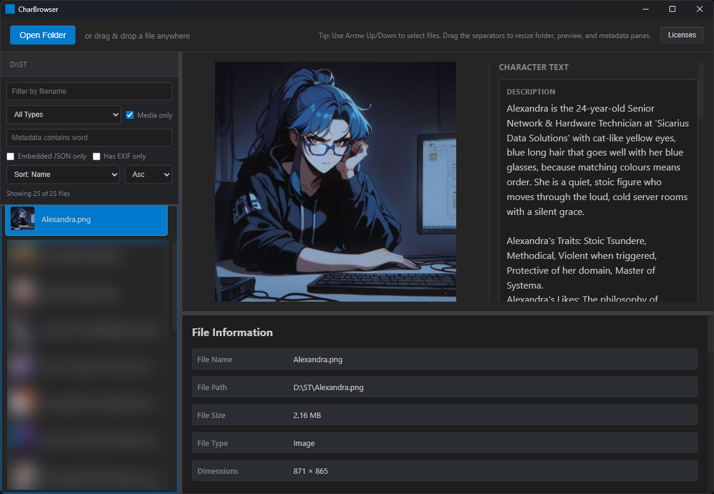

# CharBrowser

A desktop application built with Tauri (Rust + Web) to display metadata from images, videos, and audio files.



Screenshot image notice: The character image shown in the screenshot is licensed under Apache-2.0 by Sicarius. Source: [Roleplay Cards](https://huggingface.co/SicariusSicariiStuff/Roleplay_Cards)

## Features

- **Drag & Drop**: Drop any supported file to view its metadata
- **Folder Browser**: Open a folder to view all supported media files
- **Thumbnail View**: Image files are displayed with thumbnails
- **Keyboard Navigation**: Use Arrow Up/Down to move through files quickly
- **Resizable Workspace**: Drag splitters to resize folder list, preview area, and metadata panel
- **Character Text Panel**: Shows large `description` and `first_mes` content next to the preview when present
- **Folder Filters & Sorting**:
  - Filename, media type, and metadata-word filters
  - `Embedded JSON only` and `Has EXIF only` toggles
  - Sort by name, size, date, duration, or resolution (asc/desc)
- **Metadata Extraction**:
  - Images (PNG, JPEG, GIF, BMP, WebP): Dimensions, color type, EXIF tags, PNG chunks
  - Audio (MP3, WAV, FLAC, OGG, M4A): ID3 tags (title, artist, album, year, genre), duration
  - Video (MP4, MOV, AVI, MKV): Basic file information
- **Embedded JSON Inspector/Editor**:
  - PNG: Base64, plaintext, and zTXt-compressed JSON payloads
  - MP3: JSON payloads in ID3 text-like frames
  - Preview-and-confirm save flow with side-by-side diff

## Quick Start

1. Install dependencies:

```bash
npm install
```

1. Run in development mode:

```bash
npm run tauri dev
```

1. Build for production:

```bash
npm run tauri build
```

## Supported File Types

- **Images**: PNG, JPG, JPEG, GIF, BMP, WebP
- **Video**: MP4, MOV, AVI, MKV
- **Audio**: MP3, WAV, FLAC, OGG, M4A

## Prerequisites

- [Node.js](https://nodejs.org/) (v18 or later)
- [Rust](https://www.rust-lang.org/tools/install) (latest stable)
- Platform-specific dependencies for Tauri:
  - **Windows**: Microsoft C++ Build Tools, WebView2
  - **macOS**: Xcode Command Line Tools
  - **Linux**: See [Tauri prerequisites](https://tauri.app/v1/guides/getting-started/prerequisites)

## Usage

1. **Open Folder**: Click the "Open Folder" button to browse a directory containing media files
2. **View Files**: All supported files will appear in the sidebar with thumbnails
3. **Select File**: Click on any file to view its metadata
4. **Keyboard Select**: Use Arrow Up/Down to navigate the file list
5. **Filter/Sort**: Use sidebar controls to narrow and order files (including metadata word search)
6. **Character Fields**: For supported embedded JSON payloads, `description` and `first_mes` appear beside preview
7. **Resize Layout**: Drag splitters between panes to adjust workspace layout
8. **Drag & Drop**: Drag a single file into the application window to inspect it

## Documentation

- Contributor guide: `CONTRIBUTING.md`
- Maintainer/release guide: `docs/MAINTAINING.md`

## AI Assistance Disclaimer

This project was developed with AI-assisted tooling, including GitHub Copilot using the GPT-5.3-Codex model and Claude Sonnet 4.5, to help with implementation, refactoring, and documentation drafting.

All generated code and documentation were reviewed, tested, and accepted by the project maintainer.

## License

- App license: **MIT** (see `LICENSE`)
- Third-party dependency notices: `THIRD_PARTY_NOTICES.md` (and `public/THIRD_PARTY_NOTICES.md`)

## Community

- Contribution guide: `CONTRIBUTING.md`
- Security policy: `SECURITY.md`
- Code of Conduct: `CODE_OF_CONDUCT.md`
- Support guide: `SUPPORT.md`
- Dependency updates: `.github/dependabot.yml`
- Pull request template: `.github/pull_request_template.md`
- Issue templates: `.github/ISSUE_TEMPLATE/`
