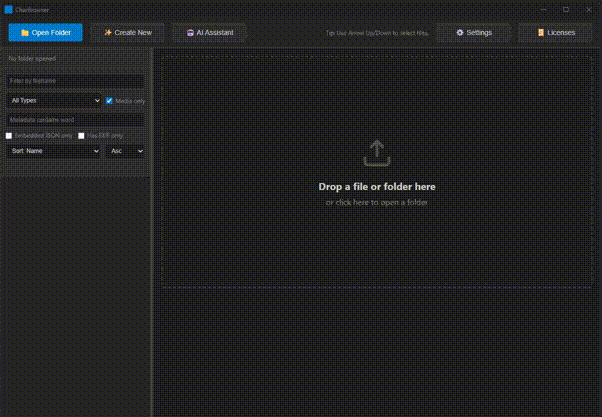

# CharBrowser

A Tauri app for browsing and editing metadata from images, videos, and audio files.


Screenshot image is licensed under Apache-2.0 by Sicarius. Source: [Roleplay Cards](https://huggingface.co/SicariusSicariiStuff/Roleplay_Cards)

## Features

### Core
- **Universal drag-drop** - Drop any supported file to view its metadata, or drop a folder to open it
- **Copy all metadata** - One-click export to clipboard
- **Delete to trash** - Delete selected files with Delete/Backspace

### Character Card Editor
- **Create cards** - Embed JSON metadata in PNG character cards
- **LLM generation** - Generate card fields via AI
- **ComfyUI image generation** - Generate character images via ComfyUI

### Metadata Editing
- **Edit directly** - FITS, MP3, FLAC metadata
- Deferred: JPEG/TIFF/OGG

## Quick Start

```bash
npm install
npm run tauri dev   # development
npm run tauri build # production
```

## AI Setup

### LLM
1. **Local**: [LMStudio](https://lmstudio.ai) or [Ollama](https://ollama.com)
2. **Cloud**: OpenAI, OpenRouter, Groq, DeepSeek, NanoGPT
3. Configure in **Settings → LLM**

### ComfyUI
1. **Download**: [ComfyUI](https://github.com/comfyanonymous/ComfyUI/releases)
2. **Configure**: Settings → ComfyUI
3. See [docs/comfyui-setup.md](docs/comfyui-setup.md)

## Card Creator Workflow

1. (Optional) Open a folder and select an image, or drag-drop one in
2. Click **Create New**
3. Fill in fields manually or click **Generate All** to use your LLM
4. Refine with swipe-to-regenerate or edit directly
5. Resize/crop the image as needed - or generate with ComfyUI
6. Click **Save** to write the PNG with embedded JSON



## Supported

- **Images**: PNG, JPEG, GIF, BMP, WebP, FITS, TIFF
- **Video**: MP4, MOV, AVI, MKV
- **Audio**: MP3, WAV, FLAC, OGG, M4A
- **Other**: JSON (preview + character card import)

## License

MIT (see `LICENSE`)

## Support & Community

- Bugs: [GitHub Issues](https://github.com/LazyGonk/charbrowser/issues)
- Features: [ROADMAP.md](ROADMAP.md)
- Contribute: [CONTRIBUTING.md](CONTRIBUTING.md)
- Security: [SECURITY.md](SECURITY.md)
- ComfyUI Setup: [docs/comfyui-setup.md](docs/comfyui-setup.md)

This project was developed with AI-assisted tooling. All code was reviewed and tested by maintainers.